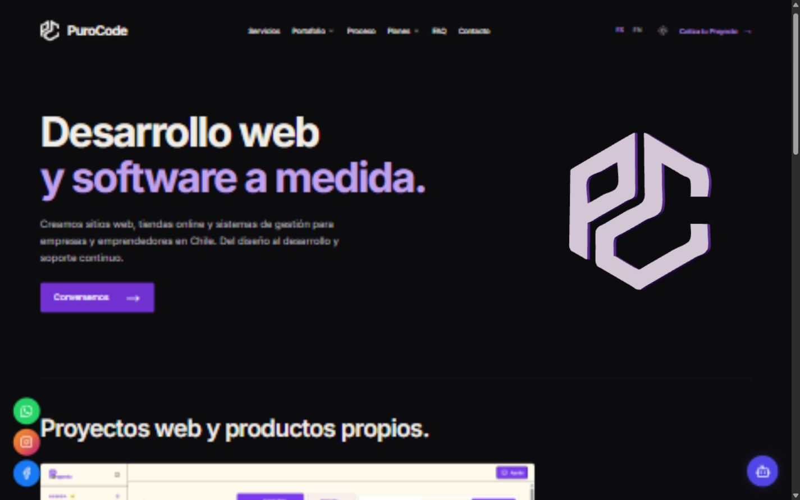
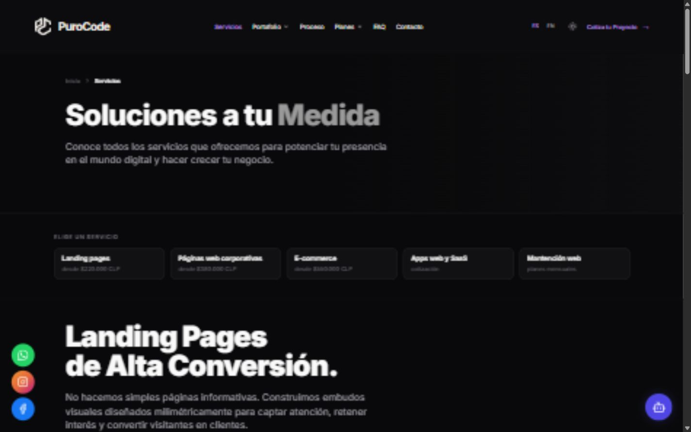
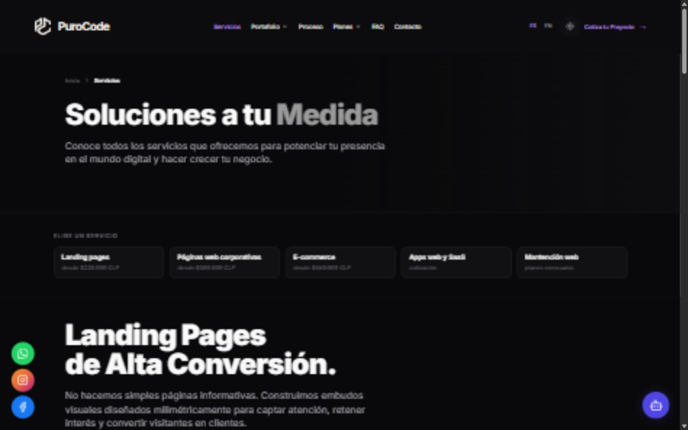
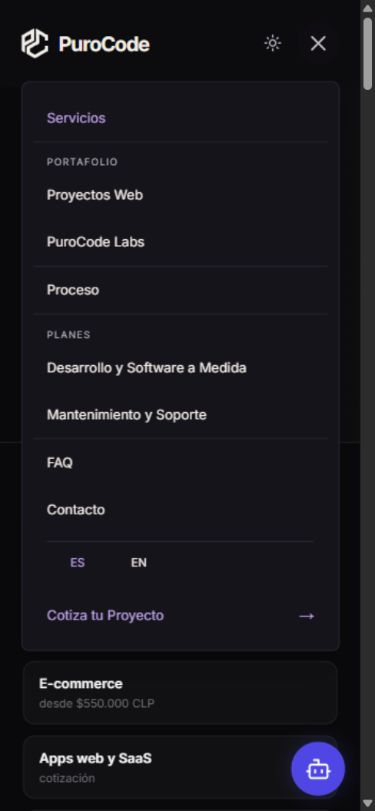
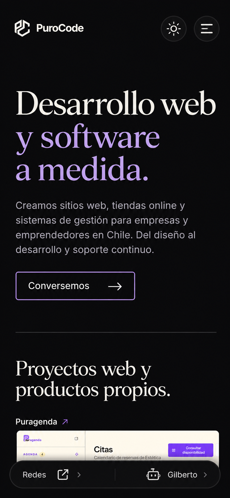
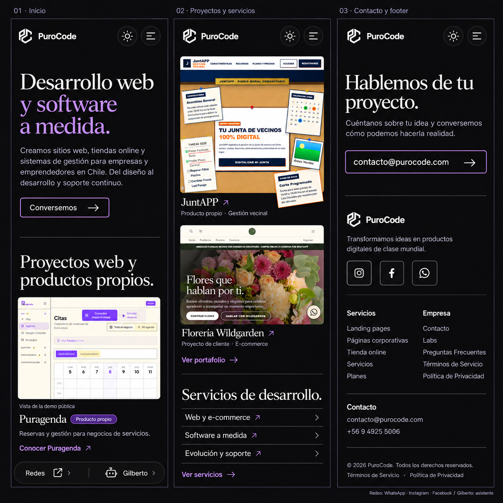
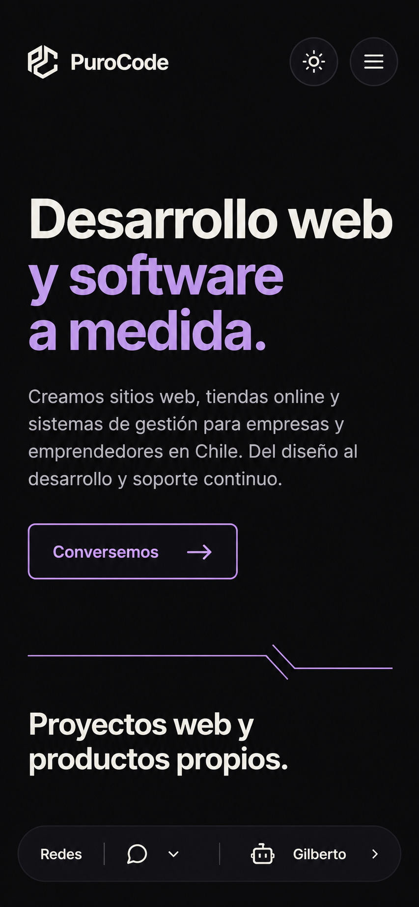
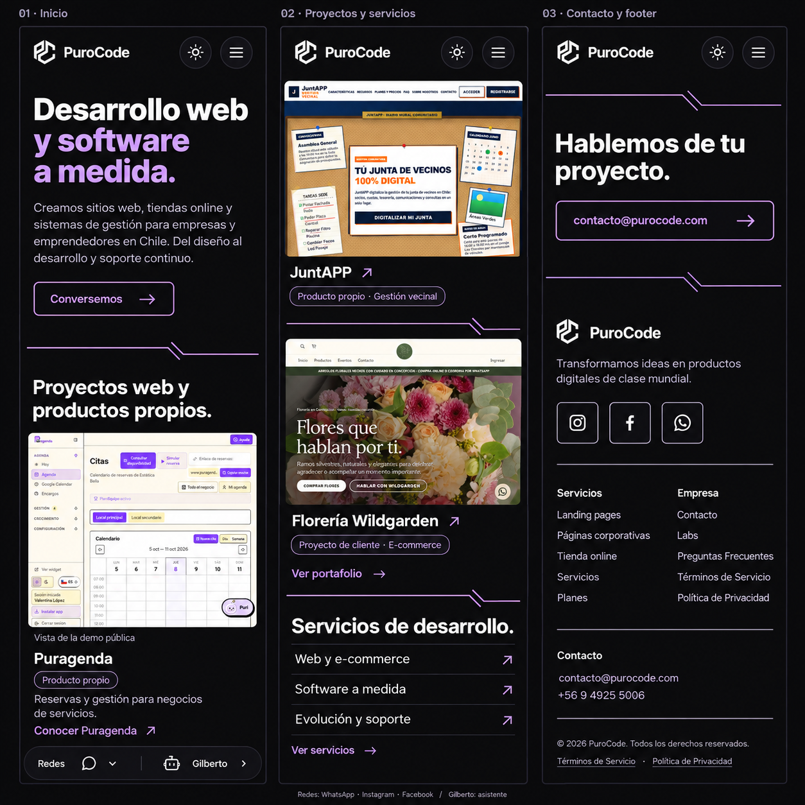
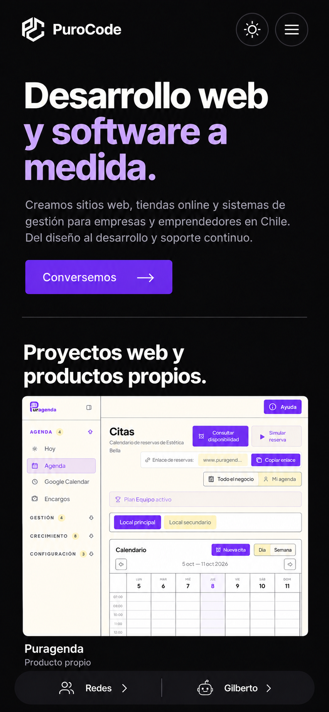
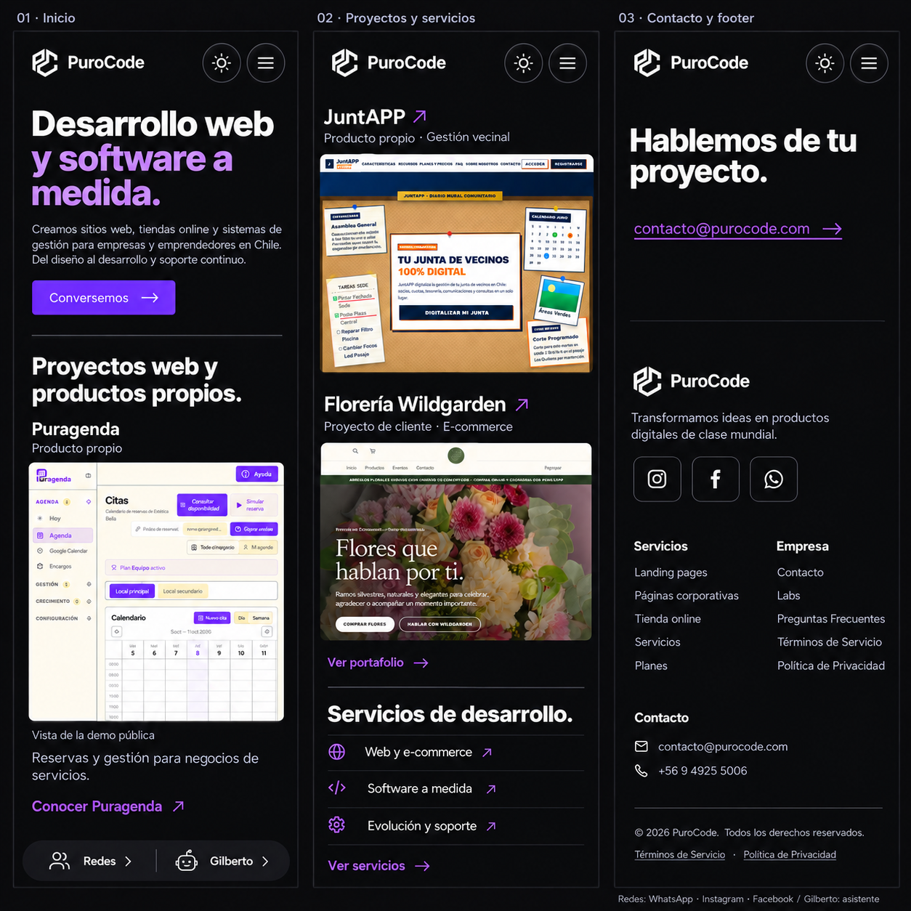

# PuroCode — Navbar global y propuestas móviles
Fecha: 8 de octubre de 2026. Base Git: `31103c1`. Rama local: `codex/navbar-global-mobile-proposals`.

## Resultado 1 — Navbar implementado

La Home montaba HomeHeader y 22 páginas internas montaban otro Header. Diferían en ancho, altura, tamaño de marca, fondo, breakpoint (1100 frente a 768 px), dropdowns y organización móvil. Las páginas legales tenían una tercera cabecera. Contrasté también el historial del Header, incluido `86773cc`, que había corregido el contacto duplicado en móvil.

Ahora hay un único SiteHeader montado en el layout público, fuera de las transiciones de página, con enlaces en src/lib/navigation.ts. Se eliminaron ambos headers anteriores y los duplicados legales. La identidad, orden, colores, tema, idiomas y menú son compartidos. Los portales privados /admin y /mi-sitio conservan su navegación funcional.

Se conservan Servicios; Portafolio con Proyectos Web y PuroCode Labs; Proceso; Planes con Desarrollo y Software a Medida y Mantenimiento y Soporte; FAQ; Contacto; Cotiza tu Proyecto; ES/EN y selector de tema. Los dropdowns funcionan con clic y teclado; Escape cierra y devuelve el foco. El menú móvil tiene scroll propio y enlaces de al menos 48 px. También se cierra al cambiar de ruta o de breakpoint.

El acceso /formulario apuntaba a /#planes, una sección que ya no existe. Una redirección HTTP 307 lo lleva ahora a /planes#planes, desde donde siguen disponibles los briefings originales. No se cambiaron planes ni precios. El enlace utiliza navegación nativa para evitar un fallo del Router durante la redirección observado en desarrollo.

Los briefings conservan progreso, precio, preview y protección antes de salir. Sus enlaces del navbar usan navegación nativa para que actúe el beforeunload existente. La barra de herramientas queda debajo del navbar y el preview de pantalla completa por encima. En una prueba con un campo local, intentar salir conservó la URL y el valor; el diálogo de beforeunload no se expuso en la herramienta. No se enviaron formularios.

Gilberto sigue montado globalmente. Se verificó su apertura/cierre en Contacto. Las redes conservan sus enlaces y la distribución vigente; el menú oculta temporalmente los flotantes para que no lo cubran y los restituye al cerrar. Las rutas que ya no montaban SocialFloater siguen ofreciendo los enlaces sociales en su footer. La nueva distribución propuesta abajo todavía no está implementada. No se probaron respuestas del asistente: no hay DEEPSEEK_API_KEY local.

### Validación

- Build de producción correcto: 60 páginas generadas y TypeScript correcto.
- 10 pruebas correctas: geometría PC, Home/SEO original, destinos, navbar único en 20 rutas públicas, redirección a planes y exclusión de rutas privadas.
- Lint enfocado en los componentes y configuración nuevos: correcto. El script general sigue ejecutando next lint, que Next 16 interpreta como una carpeta; es una incompatibilidad previa.
- Revisión visual a 1440 px y responsive a 320, 390, 768 y 1024 px, sin desbordamiento horizontal del navbar.
- Se comprobaron dropdowns, cambio de ruta, tema oscuro/claro, idioma, Escape, foco y recuperación del bot.
- Una comprobación final mediante el lanzador pnpm inició una reinstalación inesperada. Se interrumpió y se restauraron los 45 paquetes originales desde su respaldo local; no cambiaron los archivos de bloqueo. TypeScript, lint enfocado y las 10 pruebas volvieron a pasar usando Node directamente.
- Preview actualizado: http://127.0.0.1:3002/. No push, merge ni despliegue.

## Resultado 2 — Auditoría y diseño móvil

### Hallazgos

La captura y el código usan Inter y el mismo H1 que escritorio. Las diferencias percibidas provienen del escalado, el peso y los saltos de línea. El bloque de descripción largo, el CTA a todo el ancho y el 3D pequeño aislado debajo desplazan las primeras pruebas de trabajo. Tres círculos sociales de colores y el botón del bot compiten en el borde inferior. También falta una transición compositiva clara hacia los proyectos. El footer a 390 px pasa a una columna larga; las propuestas exploran dos columnas legibles para sus grupos.

El brief cita el titular anterior «Diseño y software para negocios reales». Conservo «Desarrollo web y software a medida» porque el usuario había descartado expresamente aquel texto y la revisión SEO anterior lo sustituyó. La descripción se mantiene. Así se comparan composiciones con el mismo mensaje actual.

### Cómo leer los mockups

Se generaron mediante image_gen incorporado, usando como referencias el escritorio aprobado y las capturas reales del repositorio de Puragenda, JuntAPP y Florería Wildgarden. No se programaron alternativas. Las vistas completas son tres tramos consecutivos de una sola Home móvil a ancho lógico 390 px, de izquierda a derecha; no son un layout de escritorio. Todas incluyen los tres proyectos, servicios, contacto, footer completo y accesos a redes/bot.

Son conceptos raster: el generador redibuja las capturas y puede alterar detalles pequeños. Durante una implementación se reutilizarían los archivos reales, no las interfaces ilustradas del mockup. Los prompts completos están en mobile-proposals/prompts.json y los ajustes puntuales en mobile-proposals/refinements.json.

### A — Editorial minimalista

Serif protagonista, contraste cálido/lila, CTA contorneado y mucho aire. Buena calidad editorial y jerarquía tranquila. Cambia la familia tipográfica actual y presenta los productos más tarde; introduciría una fuente adicional. Las capturas grandes se apilan sin carrusel.

### B — Identidad de marca

Mantiene Inter y añade reglas angulares planas derivadas del isotipo. Es reconocible y coherente con los colores actuales. La repetición de las líneas y etiquetas da más densidad; convendría contenerlas para que no compitan con las capturas.

### C — Producto primero

Hero más compacto, Inter, CTA contenido y Puragenda visible en el primer viewport. El título de cada proyecto establece contexto antes de la imagen. JuntAPP y Wildgarden siguen en bloques completos y el contacto final recupera el enlace discreto aprobado. Menor complejidad visual y mejor continuidad entre mensaje y prueba.

### Redes, bot y accesibilidad propuestas

Un dock tonal compacto tiene dos controles diferenciados: Redes abre WhatsApp, Instagram y Facebook; Gilberto abre el asistente. Las tres redes mantienen además enlaces directos en el footer. Cada control necesitaría un área táctil mínima de 44 px, espacio para safe-area-inset-bottom y separación del contenido. En el footer se reservaría espacio inferior; al abrir el menú o chat se gestionaría el foco y las superposiciones. Es una propuesta de interacción, todavía sin código.

### Evaluación

Las valoraciones son de diseño; conversión y rendimiento son previsiones, no métricas medidas.

| Criterio | A | B | C |
|---|---|---|---|
| Fidelidad al escritorio actual | Media-alta: nueva serif | Alta: Inter y marca | Alta: Inter y sobriedad |
| Calidad percibida | Muy alta, editorial | Alta, más densa | Alta, clara |
| Identidad de marca | Color y composición | La más explícita | Tipografía, color y producto |
| Claridad del mensaje | Alta | Alta | Alta |
| Navegación | Misma estructura global | Misma estructura global | Misma estructura global |
| Distribución de proyectos | Amplia, aparece más tarde | Equilibrada, más ornamento | La más temprana y jerárquica |
| Legibilidad | Alta; revisar trazos finos | Alta; más peso visual | Alta; cuidar tamaño de cuerpo |
| Potencial de conversión | Medio-alto | Medio-alto | Alto: prueba y CTA próximos |
| Complejidad de implementación | Baja-media: fuente adicional | Baja-media: reglas y etiquetas | Baja |
| Rendimiento esperado | Alto, fuente adicional | Alto, geometría plana | Alto, sin fuente nueva |

Recomiendo **C** para la versión móvil definitiva. Conserva la tipografía de la web, hace visible trabajo real antes y permite mantener el contacto minimalista. A es una buena elección si se quiere autorizar específicamente la serif; B ofrece más marca pero requiere contener la ornamentación.

En la implementación futura, la decisión de renderizar el 3D deberá tomarse antes de importar el renderer y descargar geometría en móvil: ocultarlo con CSS no evitaría la carga de WebGL. Las imágenes de proyectos deberán dimensionarse para 390 px y diferir su carga cuando queden fuera de pantalla.

**Estado de aquella entrega:** el navbar quedó implementado y las propuestas se entregaron antes de modificar la Home móvil.

**Actualización:** el usuario seleccionó C y autorizó implementarla, con el cambio global de las llamadas a conversar hacia Contacto. La implementación y sus pruebas están en [el informe de C](mobile-c-implementation.md). No hubo push, merge ni despliegue.
